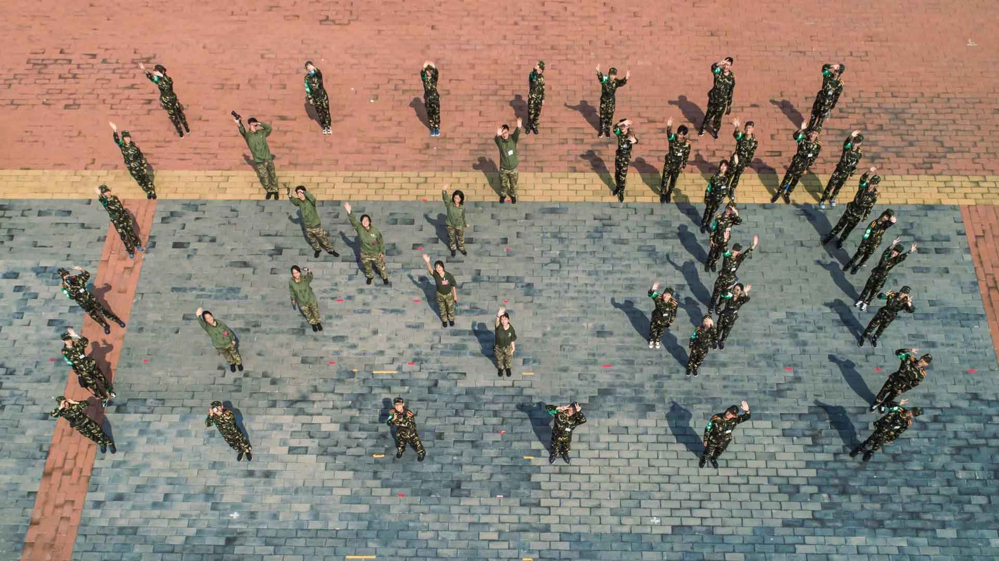
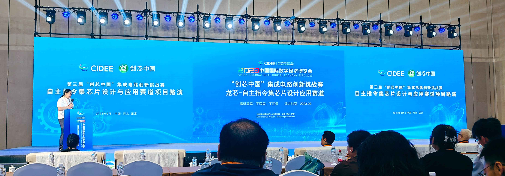
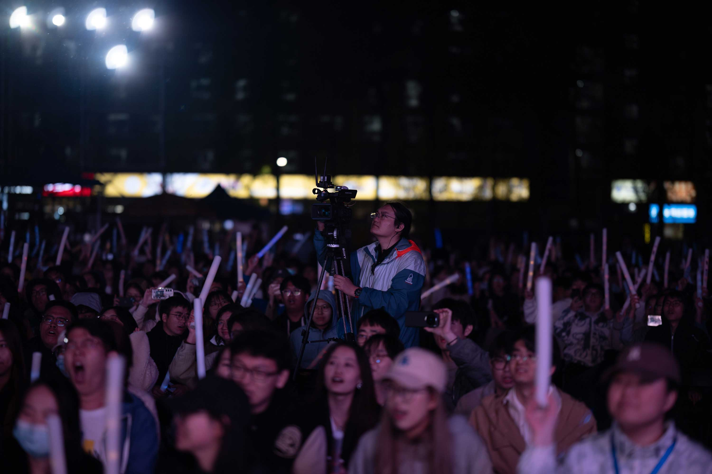

## 简介

我是北京科技大学的一名大三学生，修读计科与英语专业。如果你知道我是谁，欢迎找我来玩！

---

我来自北京，在北京上学，在北京长大。身处闹市区中，加上不怎么走动，城市似乎只是给我提供了一个住所，再无其他。每天上学，都听到电报大楼的钟声、看到府右街的红墙，或是闻到那学院小街中的书香，日复一日。偶尔有那么一些比赛可以带我离开，去到处走走，看看。现在，我从学院小街来到了学院路，却又不知路在何方。

初进大学，我读了机械专业。一年过去了，学了机械制图，打了成图大赛，加了电视台。大一的暑假，我在集训中度过了大半。几乎每天都有训练，从画法几何学，三维建模到二维绘图。但说起来大一这一年我过得还算悠闲，只有学习和一些自己的小爱好。也认识了帮助我很多的老师们，给予我引导与支持。又是一学期过去，暑假里我们去了甘肃秦安，去那里支教十四天。那些天里，我们准备了各类课程，每天做一些采访，拍一些照片。在秦安县一幢小楼楼顶，我们对着那漫天星辰，留下了难忘的回忆。

这一年我的成绩还算说得过去，但总觉得少了点什么，也许是调剂给我带来的感觉：我不够好，没能进到自己想去的专业，入学时那惨淡的分数也在提醒我这点。

随后，我就去了Reborn，修了双学位。可能我是为数不多选择这样做的人，总是想着“一定会有办法的，只要做的够快一定没有问题的”。我那时对自己的能力没有什么确切的认知，对课程也没有。第二年可谓难挨，在无休止的上课、敲代码、赶作业中度过。因为在学生电视台，还是要去经常直播，管理社团事务。我已经忘了当时是怎么做到的，只记得一周从早到晚几乎没有什么自己的时间。说起来也巧，在这一年我遇到了我在计科的导师，便加入了他的课程教研组，认识了许多学长，感谢他们对教学和后面几届同学作出的莫大贡献。这一年暑假，又是十分难忘。我们用了一整个月，真真正正写了一个自己的CPU。虽然没能进入决赛，但仍旧满足。

下一年就轻松许多，转专业的课已经补完，也不在312了。当了几门课的助教，做了一个OJ，打了龙芯杯，还主持了一项SRTP作为我认识科研的起点，好在结果不错。这一年我没有做什么，权当是给自己放松一下。可惜这一年我没看什么书，没写什么字。

现在去看我大学的前三年，路没少走，赛没少打。在整理那一沓材料时，我不禁在想这是为了什么，我最开始想要的又是什么。不上课的时候，偶尔有几天去玩一玩，但又有一些时候什么也不想干，什么也不想做。怕那突如其来的电话和微信，又生怕错过什么。买了很多书，计划大学里读完，但现在还没翻开过……

现在，课程几乎修完，上课这个词可能在我的生活中就告一段落了。但是上完课要去做什么呢？去读之前没读完的书，去写写东西，一起出去玩，或是继续泡在实验室？我想知道，但又害怕知道。想去异地读书，又不想离开北京。

可能也有疫情的原因，三年过得非常快。感谢所有人，让我能度过那些心碎的日子，感谢文学，能给我那些慰藉。

再过一年就要毕业了，那时再来补全这篇记录吧。
