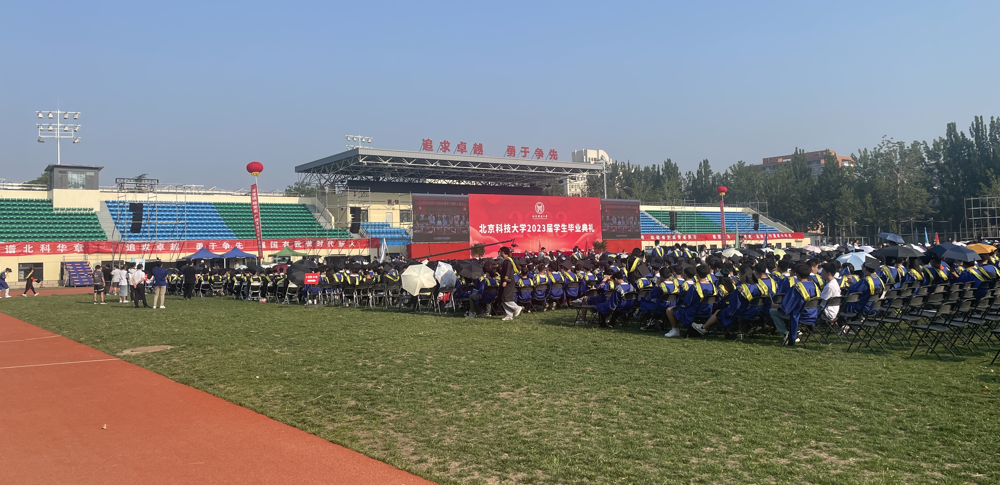
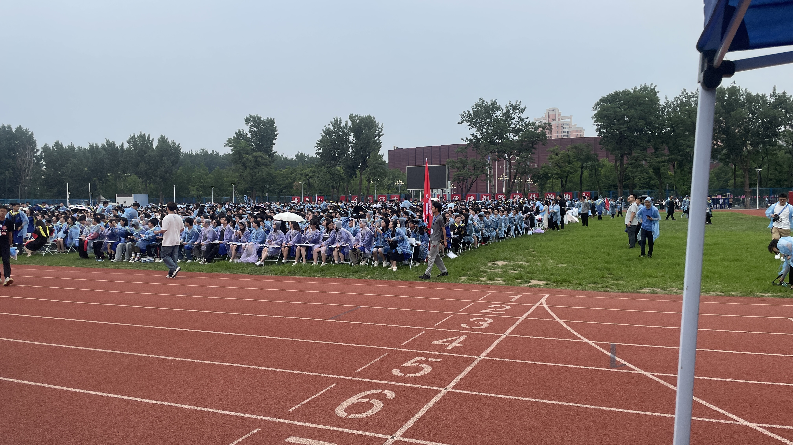

又是一年毕业季。23年6月16，最高温接近40度的一天，22届的毕业生返校，与23届的毕业生一同参加这次毕业典礼。对我来说，这次毕业典礼和我的关系大概只是一次直播工作，我并不认识那些毕业的同学，也没什么特殊的感觉。只是看着他们都穿着学位服，和亲友合照。

24年6月21，今年的毕业典礼没有之前那么热，典礼过程中还下起了雨。党宣的学长今年第二次毕业了，穿上了硕士学位服来工作。电视台的两位学长学姐也穿上了学位服，完成在学校的最后一次工作后，参加学位授予仪式，就此和本科正式告别了。

感觉这种仪式对于大部分人可能没什么意义，自己没有被表彰，没有上台讲话，也就没什么存在感。但这确实代表着大学的一段时光就此结束。我认为这种仪式可能繁复，但正是这种复杂才能让人记住，体现出仪式的庄重与严肃。

今年的毕业典礼，也算是正式和视觉组的一些学长告别了，从此不在一个城市，也不知道能不能再有联系。在312的将近一年时间，又经历了很多事，但感谢你们，能陪我走过这一年。不知道以后还能不能经常见面，也不知道还有没有人能这样陪我。

再有两个月，就又是开学典礼了。送走毕业生，迎来新生，周而复始。

明年我也会穿上学位服，完成最后一次直播，顺利毕业，继续漫漫求学路。
